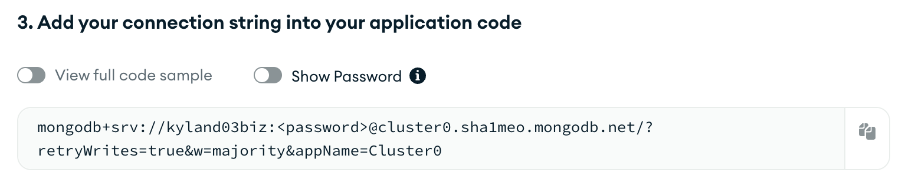

# 01-movie-search-app

This project was created following [Full Stack Web Development for Beginners (Full Course on HTML, CSS, JavaScript, Node.js, MongoDB)](https://www.youtube.com/watch?v=nu_pCVPKzTk) by freeCodeCamp.

`movie-app`: contains code for frontend

`reviews-api`: contains code for the Express backend and interactivity with MongoDB database

## Overview

This project is a full stack movie search app, with the frontend using HTML, CSS, and JS, and the backend using Node.js, express.js, and MongoDB. The frontend allows for the user to search for movies in TMDB, and add/edit/remove reviews to individual movies stored using this app's backend.

NOTE: The frontend still works without the backend (including the search functionality), but will be unable to generate information for reviews.

## Running on your local dev environment
### Setting up the frontend
The frontend code uses data from [The Movie Database](https://www.themoviedb.org/?language=en-US) (TMDB) in order to populate elements. In order to ensure the code works properly, make an account on TMDB and [obtain an api key](https://developer.themoviedb.org/reference/intro/getting-started).
1. Create a file in the `movie-app` directory titled `secret.js`.
2. In `secret.js`, add this line of code:

`const API_KEY = "YOUR TMDB API KEY HERE";`

Your frontend should be able to run now.

### Setting up the MongoDB database
This project uses [MongoDB Atlas](https://www.mongodb.com/products/platform/atlas-database) as its database. In order to ensure it works properly, make an account and a database on MongoDB Atlas. You can follow [the instructions found in the freeCodeCamp tutorial](https://youtu.be/nu_pCVPKzTk?si=taTP4Tqjrz5ZvHng&t=21340) in order to help you with this.

1. When choosing a connection method for your cluster, make sure to connect using the MongoDB Driver and save the connection string it gives you.

2. In `reviews-api/index.js`, replace the string found in the URI variable with your connection string.

### Setting up the backend
This project uses Node.js as its backend. In order to ensure it works properly, make sure you have Node.js installed on your dev environment.

1. In the terminal, `cd` into `reviews-api`.

2. Run `npm install` inside the folder.

### Running the application
In order to make sure the application is working, make sure your frontend, database, and backend are set up properly.

1. `cd` into `reviews-api`.

2. Run `npm start`.

Now, whenever you open your frontend code, movies should be populated, and you should be able to properly add/update/delete reviews from each movie.

## Purpose of completion
The purpose of completing this project was for me to gain more experience developing full stack applications, specifically working on my frontend skills. This served as a good refresher on the fundamentals of HTML, CSS, and JS, and hopefully I can reinforce my knowledge moving forward before going back into using JavaScript frameworks such as React.

## Challenges encountered
There were not too many challenges with this project since it mainly included following the tutorial. However, the tutorial did divert a bit when it came to using MongoDB Atlas, since they used Replit as their local environment rather than VS Code (what I used). It required a bit of adjustment on my end (as seen in the *Setting up the backend* section).

## Next items
If I come back to this project in the future, some additional things I'd want to add is:
- Better styling across the frontend
- Testing for the frontend using Playwright
- Converting the backend to a simple TS app
- Adding IaC functionality to the app using Terraform in order to deploy the frontend via S3, and the backend running either on AWS Lambda or EC2
