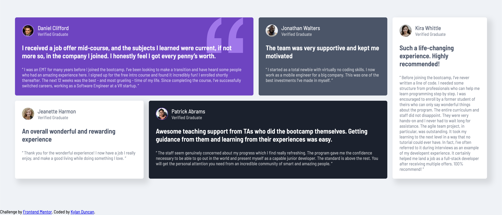

# Frontend Mentor - Testimonials grid section solution

This is a solution to the [Testimonials grid section challenge on Frontend Mentor](https://www.frontendmentor.io/challenges/testimonials-grid-section-Nnw6J7Un7). Frontend Mentor challenges help you improve your coding skills by building realistic projects. 

## Table of contents

- [Overview](#overview)
  - [The challenge](#the-challenge)
  - [Screenshot](#screenshot)
  - [Links](#links)
- [My process](#my-process)
  - [Built with](#built-with)
  - [What I learned](#what-i-learned)
  - [Continued development](#continued-development)
  - [Useful resources](#useful-resources)
- [Author](#author)
- [Acknowledgments](#acknowledgments)

**Note: Delete this note and update the table of contents based on what sections you keep.**

## Overview

### The challenge

Users should be able to:

- View the optimal layout for the site depending on their device's screen size

### Screenshot

### Links

- Solution URL: [My solution URL](https://www.frontendmentor.io/solutions/single-price-grid-component-m0RCLOw5Y0)
- Live Site URL: [My live site URL](https://github.cloudydaiyz.com/webdev-learning-center/02-web-dev-bootcamp/testimonials-grid-section)

## My process

### Built with

- Semantic HTML5 markup
- CSS custom properties
- Flexbox
- Mobile-first workflow

### What I learned

I learned more about:
- creating responsive web designs
- incorporating CSS flexbox into designs

### Continued development

If I were to continue this project in the future, some things I would add are:
- CSS Grid layout
- CSS animations for each testimonial

### Useful resources

- [Frontend Web Development Bootcamp Course (JavaScript, HTML, CSS)](https://www.youtube.com/watch?v=zJSY8tbf_ys) - This is a great course for frontend development that goes over the basic principles of HTML, CSS, and JavaScript, and provides an implementation for this project.

## Author

- Website - [Kylan Duncan](https://www.cloudydaiyz.com)
- Frontend Mentor - [@cloudydaiyz](https://www.frontendmentor.io/profile/cloudydaiyz)

## Acknowledgments

Credits to Zach Gollwitzer for the [Frontend Web Development Bootcamp Course (JavaScript, HTML, CSS)](https://www.youtube.com/watch?v=zJSY8tbf_ys) course from freeCodeCamp.
